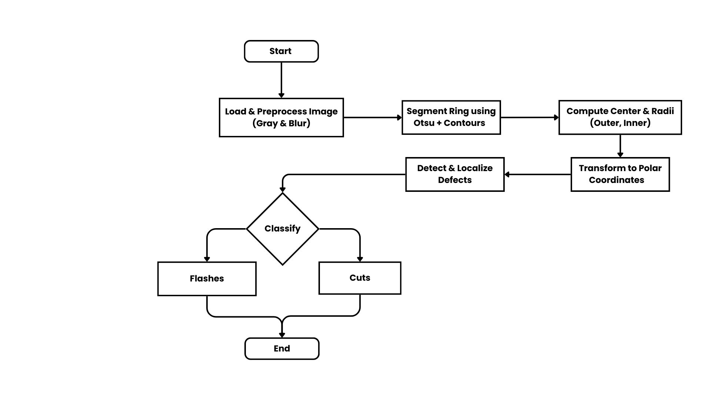
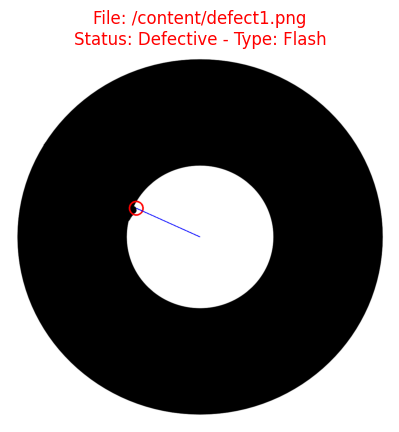
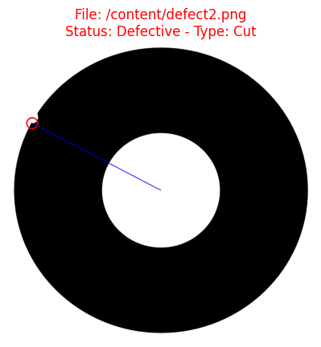
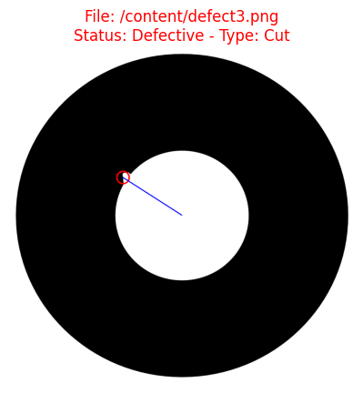
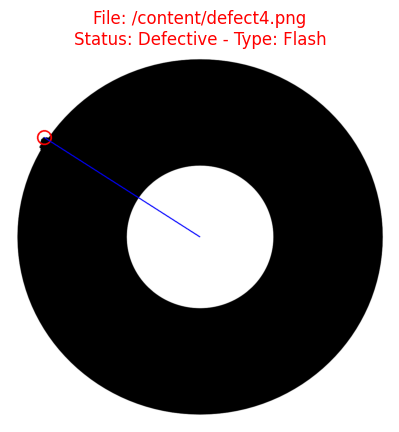
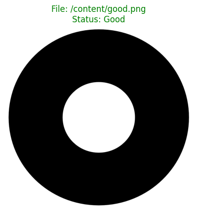

# Automated Defect Detection for Annular Components

A structured explanation of the defect detection pipeline along with flowcharts, algorithms, and evaluation stages.

---

#### 1. Flowchart

  

---

#### 2. Algorithm to Find Defects

**Input:** Image of ring-shaped component  
**Output:** Status (Good/Defective), defect type (Cut/Flash), defect location  

##### Steps

###### Load & Preprocess:
- Convert image to grayscale.
- Apply Gaussian blur to remove noise.

##### Segmentation:
- Use **Otsu Thresholding** → get binary mask.
- Extract **two largest contours** (inner & outer ring).

##### Geometry Computation:
- Calculate center using contour moments.
- Find average radii for inner and outer contours.

##### Polar Transform:
- Convert ring into unwrapped **radius vs angle** representation.

##### Defect Detection:
- For each contour, calculate radius at every point.
- Compute **local radius jumps** using difference between neighbors.
- If **max jump > 2.5 pixels**, mark as defect.

---

#### 3. Localizing the Defect 

- Identify **defect point** = location with largest local radius jump.
- Overlay **red circle** on defect point, **blue line** from center to defect for visualization.
- Store coordinates for further processing/reporting.

---

#### 4. Classifying the Defect

  
  
  
  
  

- Compare **defect radius vs average radius**:
  - **Defect radius < average radius → Cut (material missing)**  
  - **Defect radius > average radius → Flash (extra material)**  
- Assign label for final result.

---

This document presents the flowchart for our defect detection system, explaining our choice of the final, successful algorithm.
I selected the 'Local Radial Difference' method after our initial 'Global Standard Deviation' approach proved unreliable, failing by misclassifying good images due to minor pixel noise.
This final, robust model accurately identifies all true defects by focusing on sharp, localized discontinuities, resolving the initial method's inaccuracies.

---
