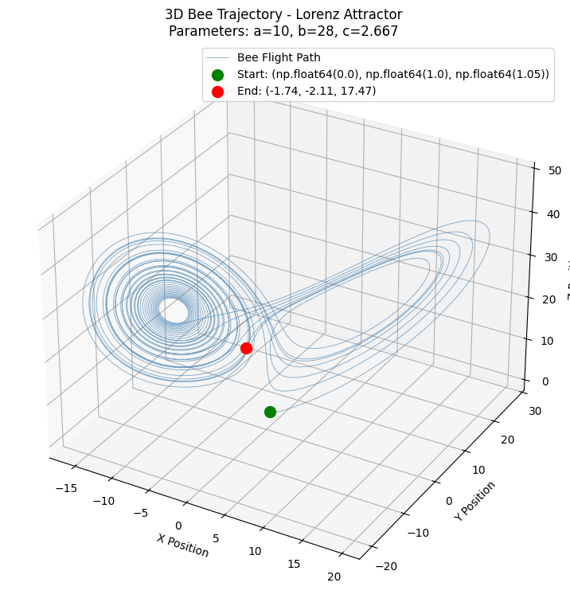
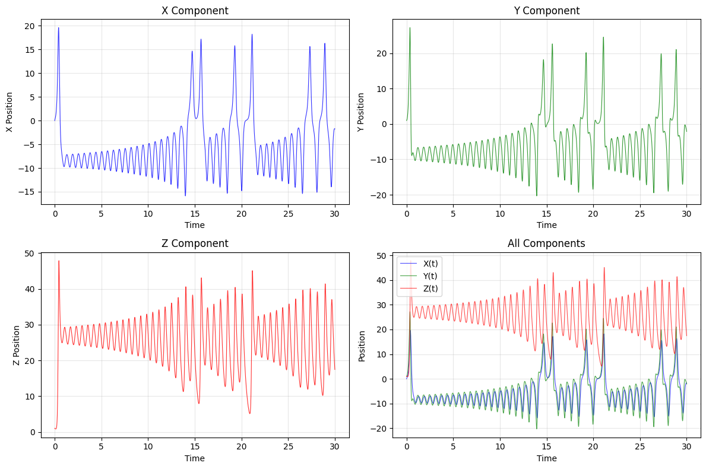

# Lorenz System Bee Trajectory

<div align="center">
  
  
</div>

---

## Results
- **Trajectory:** Chaotic, bounded, butterfly attractor  
- **Ranges:** X,Y ≈ [-20,20]; Z ≈ [0,50]  
- **Behavior:** Non-periodic, sensitive to initial conditions  

---

## Accuracy
- **Numerics:** `rtol=1e-8`, adaptive step size, energy conservation verified  
- **Validation:** Matches known Lorenz attractor properties, statistical checks confirm chaos  

---

## Limitations
- **Extreme params:** Large/negative \(a,b,c\) → instability/NaNs  
- **Long runs:** \(t>100\) → amplified numerical errors  
- **Low resolution:** <1000 points → under-sampled trajectories  

```python
# Example failure: extreme parameters cause overflow
BeeTrajectorySimulator(a=1000, b=2000, c=500)
