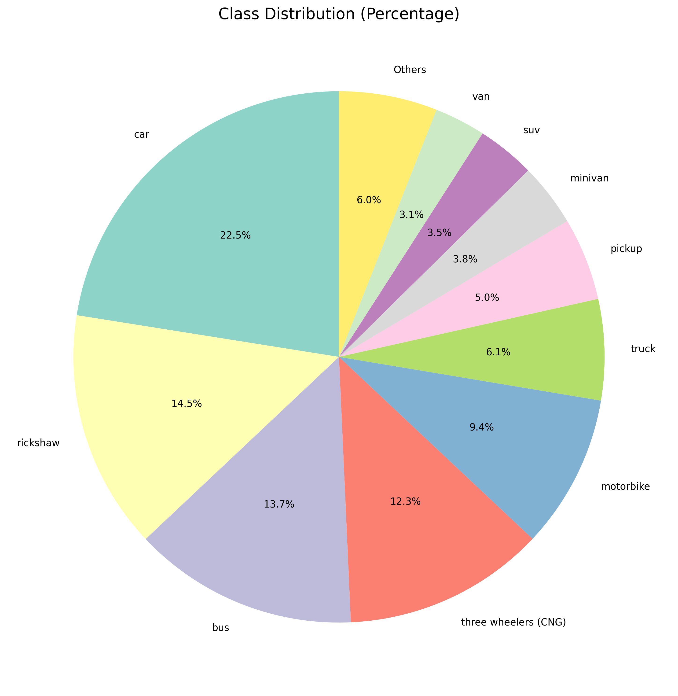
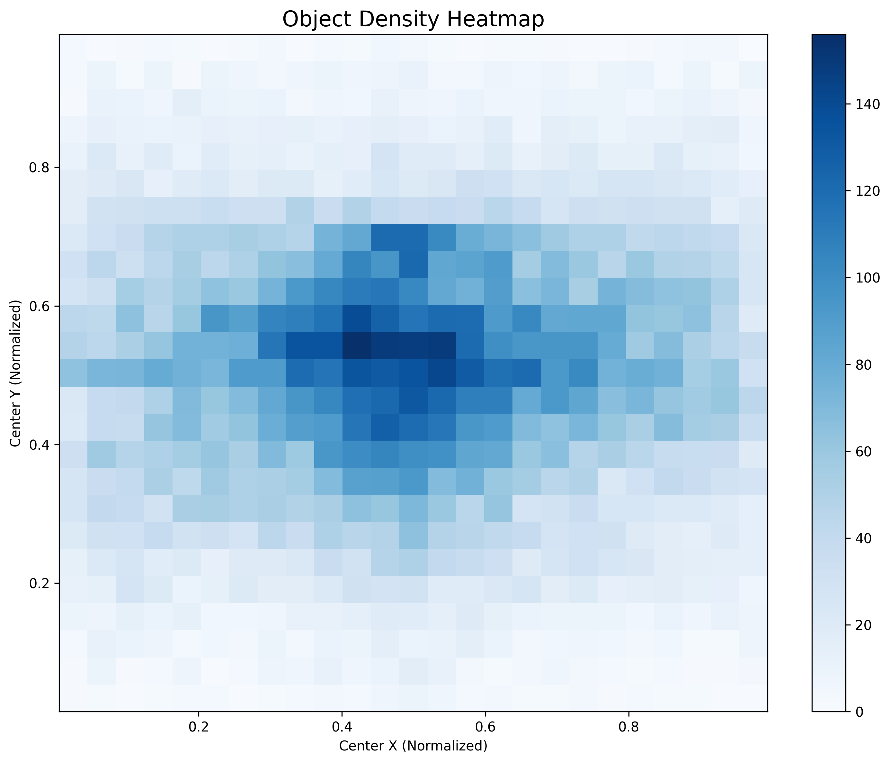
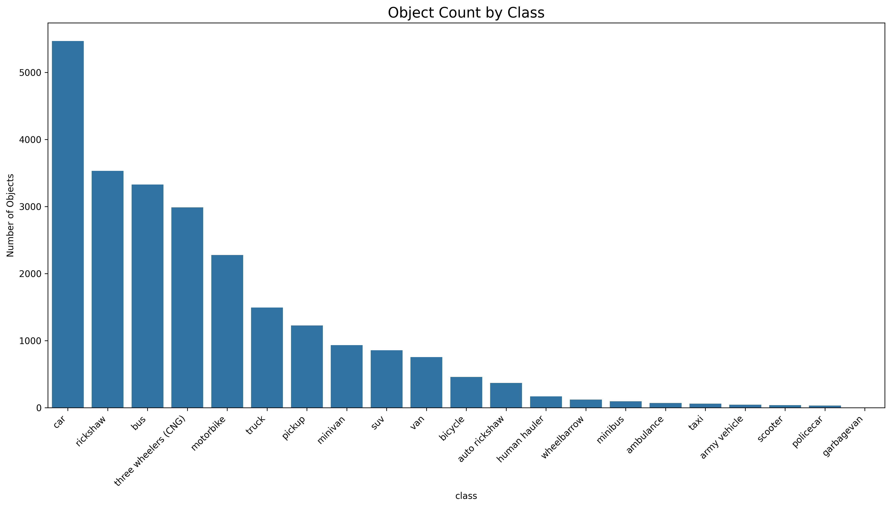
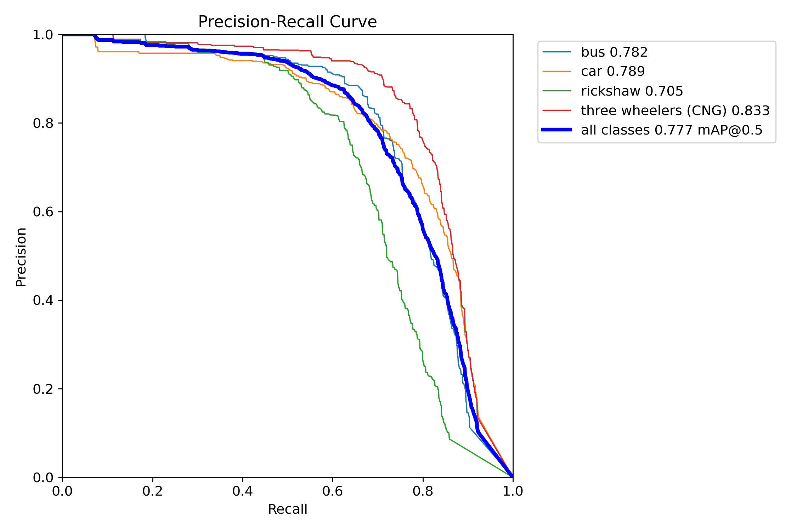
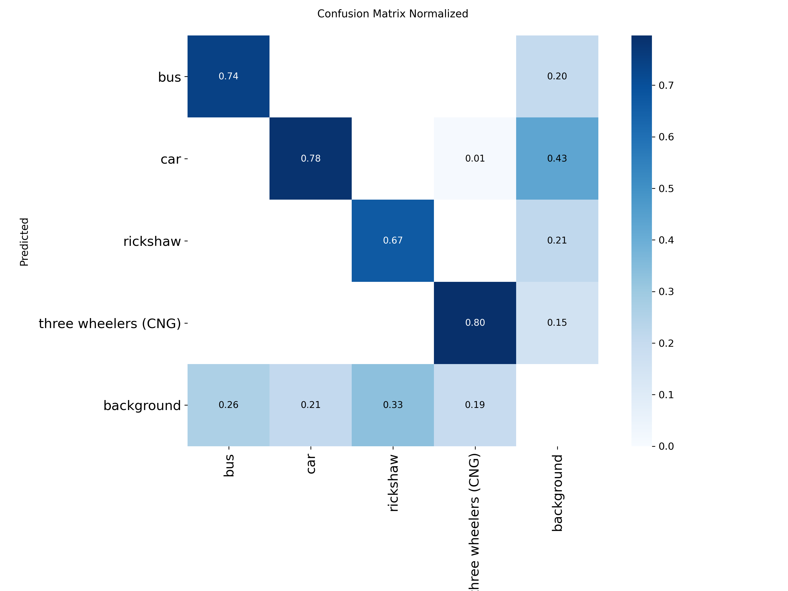
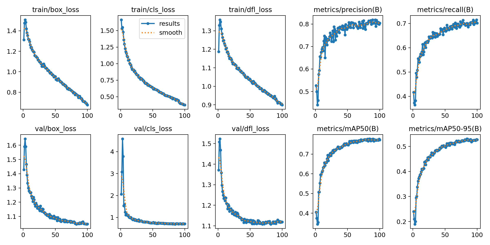
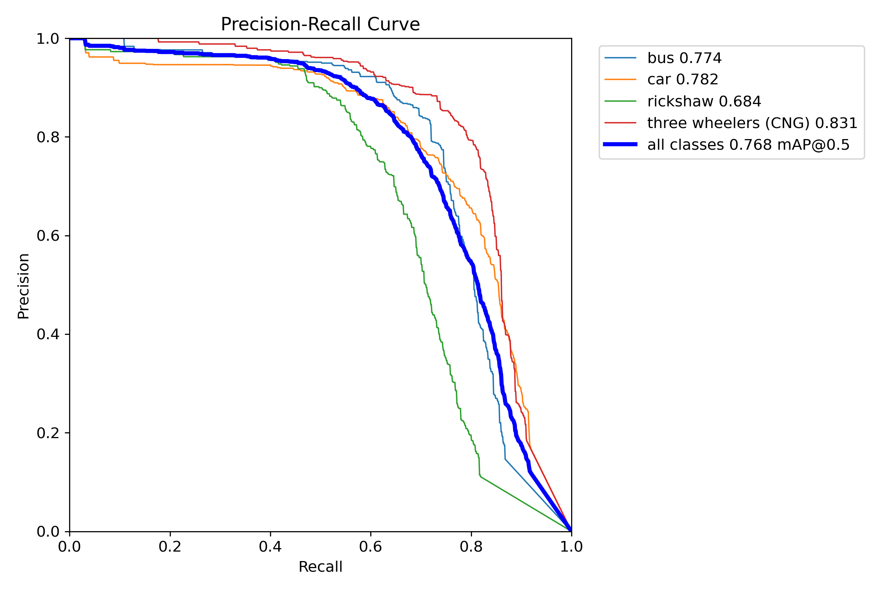
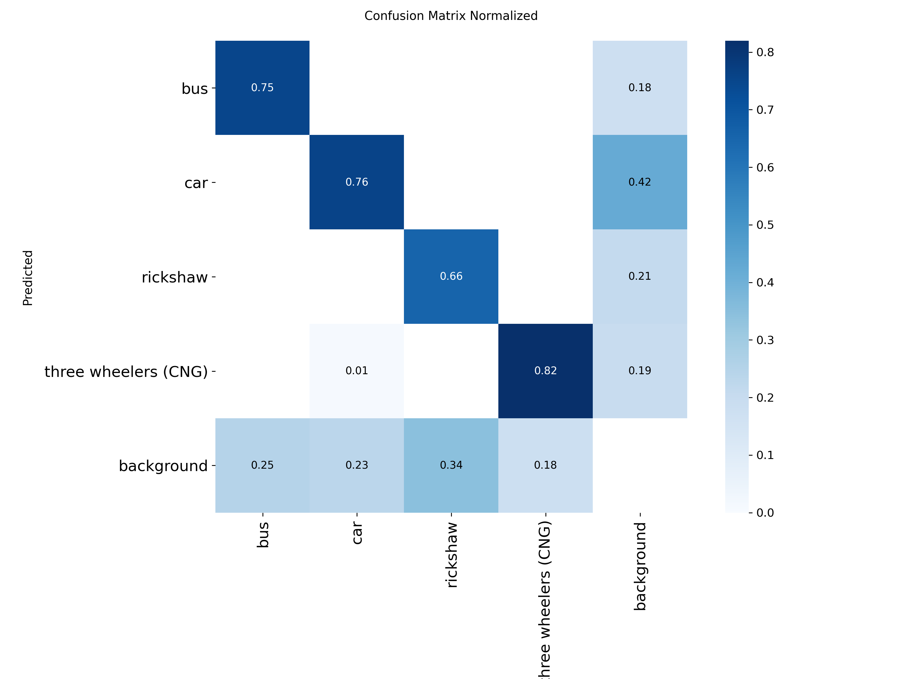
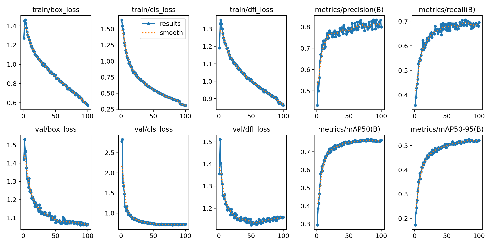

# Vehicle Detection and Classification Project

This project aims to detect and classify vehicles in images using state-of-the-art object detection models. The primary goal is to identify the location and type of vehicles such as cars, buses, and motorbikes.Two models, YOLOv8l and an experimental YOLOv11l, were trained and evaluated to determine the most suitable architecture for this task.

## Exploratory Data Analysis

  
  
  

## Model Comparison

A comprehensive evaluation was performed on a test dataset to compare the performance of YOLOv8l and YOLOv11l. The comparison was based on key object detection metrics and real-world inference speed.

| Metric                        | YOLOv8l     | YOLOv11l    |
| :---------------------------- | :---------- | :---------- |
| **mAP@50 (Overall Accuracy)** | 0.781       | 0.776       |
| **mAP@50-95 (Box Precision)** | 0.540       | 0.528       |
| **Precision** (Fewer False Alarms) | 0.845       | 0.805       |
| **Recall** (Finds More Objects)    | 0.716       | 0.723       |
| **Inference Speed (FPS)** | 14.19 FPS   | 14.89 FPS   |

## YOLO11l

  
  
  

## YOLOv8l

  
  
  

## Final Verdict

For this vehicle detection project, the recommended model is **YOLOv8l**.

The increase in accuracy and, most importantly, the **~4% increase in precision** offered by YOLOv8l is more valuable than the minor speed boost from YOLOv11l.
A difference of 0.7 FPS is often negligible in a real-world application, but a higher precision score means you can trust the model's detections more, leading to a more robust and reliable system. You get better performance where it counts the most.
